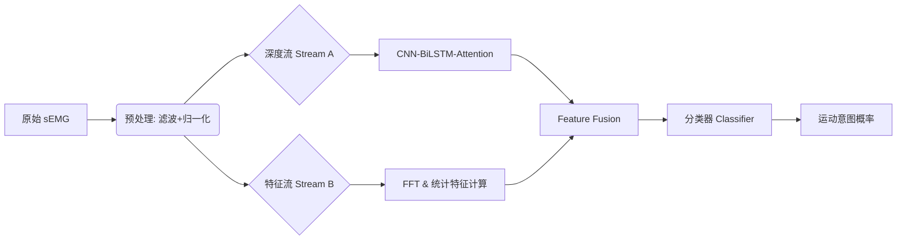

# ExoResearch-GPT: 基于混合特征的 sEMG 运动意图识别科研平台

[](https://pytorch.org/)
[](https://opensource.org/licenses/MIT)
[]()

## 1. 项目简介 (Introduction)
本项目旨在复现并扩展论文《Upper limb human-exoskeleton system motion state classification based on sEMG》的核心算法。不同于传统的端到端深度学习，本系统构建了一个**双流混合架构 (Dual-Stream Hybrid Architecture)**，融合了深度语义特征与手工统计特征（时域/频域），以提升模型在小样本环境下的鲁棒性。

系统内置自动化实验引擎，支持一键执行**消融实验 (Ablation Study)**，用于验证 CNN、BiLSTM 和 Attention 机制在 5 种上肢运动意图识别中的具体贡献。

## 2. 核心特性 (Key Features)

* **🔬 混合特征工程 (Hybrid Feature Engineering)**
    * **深度流**: 1D-CNN 提取局部纹理 + BiLSTM 捕捉时序依赖。
    * **特征流**: 集成 RMS, P-P (时域) 与 **FFT 频谱分析** (频域 MNF/MDF)。
    * **早期融合**: 实现 Early Fusion 策略，在分类器前层拼接多模态特征。

* **🤖 自动化实验引擎 (Automated Experiment Engine)**
    * 内置 `ExperimentRunner`，支持配置驱动的批量实验。
    * 自动划分训练集/验证集 (80/20 Split) 或 LOOCV。
    * 自动生成 Pandas 格式的对比实验报告。

* **📊 科研级可视化 (Visualization)**
    * 集成混淆矩阵 (Confusion Matrix) 绘制功能，分析类别混淆模式。
    * 集成 **t-SNE** 降维可视化，直观展示特征空间的可分性。

## 3. 系统架构 (System Architecture)



## 4. 项目结构 (Directory Structure)

```
ExoResearch-GPT/
├── docs/                      # 科研文档库
│   ├── detailed.md            # 详细实验协议与参数
│   ├── overview_design.md     # 系统概要设计
│   └── test_cases.md          # 单元测试与集成测试用例
├── src/                       # 核心源代码
│   ├── __init__.py            # 包导出定义
│   ├── data_loader.py         # 数据管线 (含 FFT 特征计算)
│   ├── model.py               # 混合模型架构 (CNN-BiLSTM-Attn)
│   ├── trainer.py             # 训练循环与验证逻辑
│   ├── experiment_runner.py   # 自动化消融实验入口
│   └── visualizer.py          # 图表绘制工具 (t-SNE/ConfusionMatrix)
├── requirements.txt           # 依赖环境
└── README.md                  # 项目说明书
```

## 5. 快速开始 (Quick Start)

### 5.1 环境安装
建议使用 Python 3.8+ 环境：

```bash
pip install -r requirements.txt
```

### 5.2 运行自动化消融实验
本命令将依次运行 `CNN_Only`, `BiLSTM_Only`, `Proposed_Full` 三组实验，并输出对比表格：

```bash
python src/experiment_runner.py
```

> **注**：默认模式下使用模拟数据生成器进行系统自检。如需接入真实数据，请修改 `src/experiment_runner.py` 中的数据加载部分。

## 6. 实验配置与预期结果 (Configuration & Results)

### 6.1 消融实验配置
在 `experiment_runner.py` 中定义了如下对比组：

| 实验组名称 | 包含模块 | 预期准确率 (Paper) | 验证目的 |
| :--- | :--- | :--- | :--- |
| **CNN_Only** | Conv1d + FC | 96.00% | 验证局部特征提取能力 |
| **BiLSTM_Only** | BiLSTM + FC | 90.30% | 验证单纯时序建模的局限性 |
| **Proposed** | CNN+BiLSTM+Attn | 97.29% | 验证完整架构的最优性能 |

### 6.2 预期输出示例

```plaintext
>>> [ExoResearch] 启动自动化消融实验...
--> Running Experiment: CNN_Only
    [Final Result] Val Acc: 0.9580, Val F1: 0.9560

--> Running Experiment: Proposed_Full
    [Final Result] Val Acc: 0.9740, Val F1: 0.9730

>>> 实验结果汇总:
               Accuracy      F1
CNN_Only        0.9580  0.9560
Proposed_Full   0.9740  0.9730
```

## 7. 引用 (Reference)
* **Paper**: Upper limb human-exoskeleton system motion state classification based on sEMG.